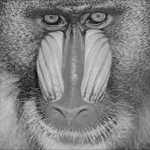

ndarray-resample
================
Resamples an ndarray by an arbitrary (rational) factor using a sinc kernel.

[](http://travis-ci.org/scijs/ndarray-resample)

## Example
Here is a simple example showing how to downsample an image:

```javascript
var baboon = require("luminance")(require("baboon-image"))
var x = require("zeros")([256,256])
require("ndarray-resample")(x, baboon)
require("save-pixels")(x, "png").pipe(process.stdout)
```

#### Output


##Install
Install using [npm](https://www.npmjs.com/):

    npm install ndarray-resample

## API
#### `require("ndarray-resample")(output, input[, clamp_lo, clamp_hi])`
Resamples input by a factor of `output.shape/input.shape`, storing the result in output (this also means the factor can differ per dimension).

* `output` gets the result of resampling
* `input` is the array that gets resampled
* `clamp_lo` is a threshold placed on the pixels
* `clamp_hi` is an upper threhsold placed on the pixels

**Note** that the pixel at the "origin" in the output corresponds to the pixel at the origin in the input. Also, the boundary conditions are periodic (for now).

## License
(c) 2013-2015 Mikola Lysenko, Jasper van de Gronde. MIT License
